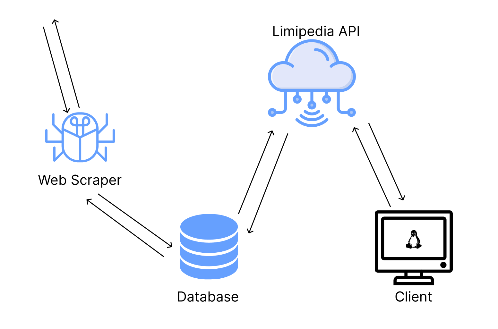

<div style="display:flex; align-items:center;">
    
    &nbsp;&nbsp;&nbsp;
    <h1 style="display:inline-block"> Limipedia (Unofficial)</h1> 
</div>


The unofficial Unison League API.

## Demo


**Limipedia (Unofficial)** is a project that aims to solve the lack of dev tooling, apps and flexibility currently in the Unison League Community. It was designed with a simple REST interface that allows:

<a name="features"></a>

- Sorting by `name` (descending and ascending).
- Querying `offsets`.
- `Limits`.
- Choosing `fields` to return.
- Searching by `name`, `skill_name`, `skill_effect`.
- Query by `id`.


## Documentation

This project has 2 main modules the `Scraper` and the `API` service.



- ### Scraper
    This modules scrapes and parses the relevant data from the [official website](http://jam-capture-unisonleague-ww.ateamid.com/en/index.html) and updates database (when necessary).

- ### API
    [Queries](#features) database and resolve queries. It is also self documented due to `FastAPI`. To view the different `GET` methods, spin up server and hit up the `localhost:<port>/docs`


<br/>
<br/>
<details> 
    <summary>Sample Monster Payload</summary> 

```json

  {
    "id": 146497683774,
    "name": "Apollo, Sun Incarnate",
    "icon_xl": "http://jam-capture-unisonleague-ww.ateamid.com/images/equipicon/l_size/4415002.png",
    "thumbnail": "http://jam-capture-unisonleague-ww.ateamid.com/images/equipicon/4415002.png",
    "basic_info": {
      "rarity": "UR",
      "gear_type": "Monster",
      "gear_cost": 30,
      "element": "Fire",
      "potential_count": 5,
      "max_level": 100,
      "collaboration": null
    },
    "skill": {
      "skill_name": "Summerlicious!",
      "effect": "Ability Power 110. Damages all enemies 3 times with physical fire damage. Chance to miss. Level bonus: Ability Power boosted by 10 for each increase in Skill level."
    },
    "reforge_info": {
      "before_reforging": {
        "id": 221668907447,
        "icon_url": "http://jam-capture-unisonleague-ww.ateamid.com/images/equipicon/4414004.png",
        "icon_name": "Apollo"
      },
      "after_reforging": "-"
    },
    "stats": {
      "initial": [
        "780",
        "-",
        "780",
        "-"
      ],
      "max_1": [
        "3415",
        "-",
        "3415",
        "-"
      ],
      "max_2": [
        "3497",
        "-",
        "3497",
        "-"
      ]
    },
    "hidden_potential": {
      "lv_1_effect": "ATK Up 1000",
      "lv_2_effect": "Blind Resistance +20",
      "lv_3_effect": "DEF Up 1000",
      "lv_4_effect": "DEF Up 1000",
      "lv_5_effect": "ATK Up 1500",
      "restrictions": null
    },
    "passive_skill": null,
    "burst_skills": null,
    "enlightening_info": {
      "before_enlightening": "-",
      "after_enlightening": {
        "id": 427120830611,
        "icon_url": "http://jam-capture-unisonleague-ww.ateamid.com/images/equipicon/4415332.png",
        "icon_name": "[Blazing First Trial] Apollo"
      }
    },
    "enlightening_materials": {
      "gears": [
        {
          "id": 212647278292,
          "icon_url": "http://jam-capture-unisonleague-ww.ateamid.com/images/equipicon/1104901.png",
          "icon_name": "Crimson Spirit Orb × 2"
        },
        {
          "id": 101913407893,
          "icon_url": "http://jam-capture-unisonleague-ww.ateamid.com/images/equipicon/4414901.png",
          "icon_name": "Red Passa King × 3"
        }
      ],
      "items": [
        {
          "id": 170421243294,
          "icon_url": "http://jam-capture-unisonleague-ww.ateamid.com/images/itemicon/item_80128.png",
          "icon_name": "Apollo's Necklace × 5"
        },
        {
          "id": 327051673401,
          "icon_url": "http://jam-capture-unisonleague-ww.ateamid.com/images/itemicon/item_3002.png",
          "icon_name": "Fire Medal × 500"
        }
      ]
    }
  },
  
```

</details>

## Setup

1. Clone repository 
```
git clone https://github.com/MAE-BK201/limipedia.git
```
2. Create and activate virtual environment (Optional)
```bash
#  Windows
python -m venv env # create virtual environment
env/Scripts/activate # activates environment


# Unix
python3 -m venv env
source env/bin/activate
```
3. Install server dependencies.
```
pip install -r requirements.txt
```

4. Start server
```bash
# commands are in the Makefile
python src/main.py # runs api
```

## Future Plans
- Creating a dedicated documentation page.
- Resolve database collisions (DefGears).
- Integrated testing for API.
- Push to heroku.
- Dockerize.
